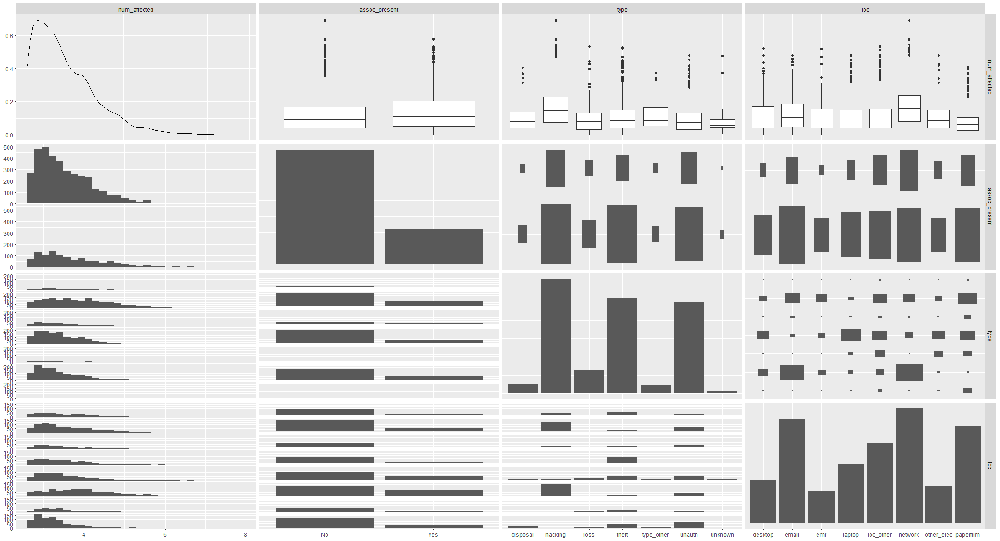
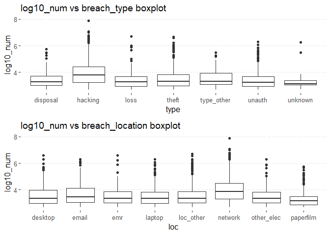
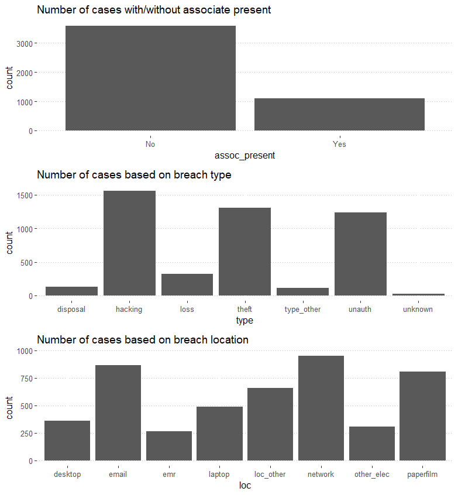
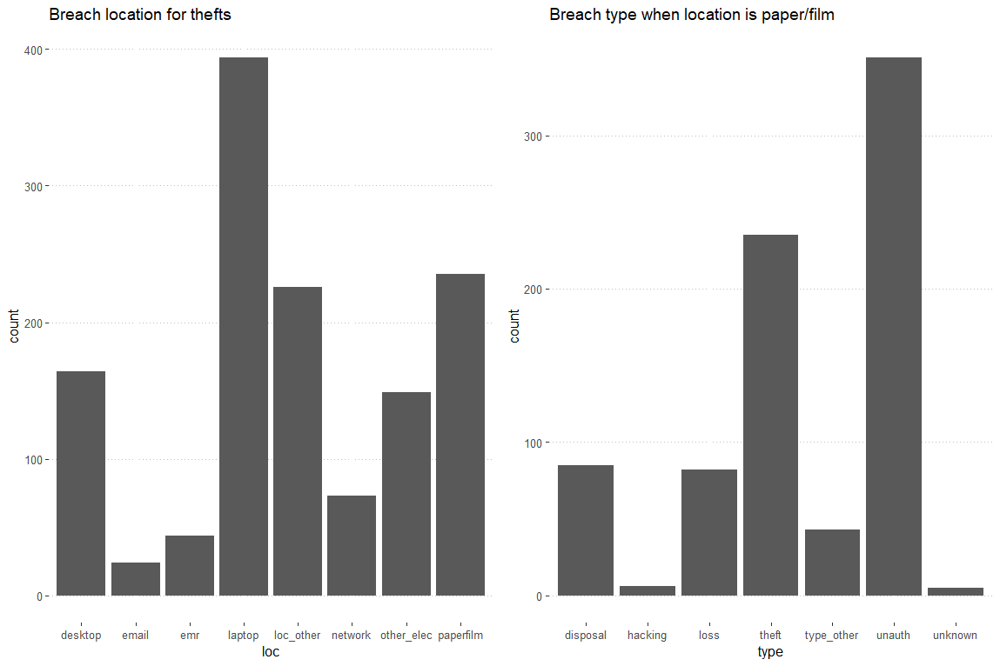
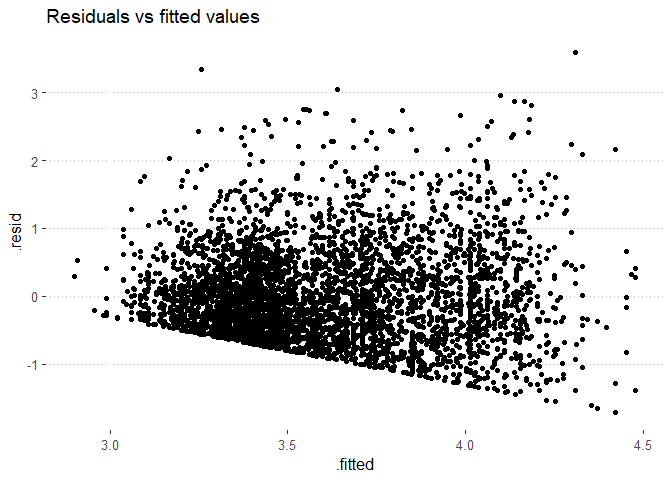
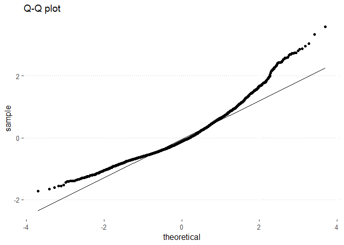

Health data breaches
================
The Health Insurance Portability and Accountability Act (HIPAA) of 1996
was one of the most important pieces of legislation to ensure the
privacy of patients’ protected health information. Unfortunately, every
year there are data breaches of medical data that lead to exposure of
protected health information. The HITECH act of 2009 mandates that
companies must disclose any data breaches impacting 500 or more
individuals to the government. This project takes a look at all of the
reported data breaches since 2009 in an attempt to understand the
underlying factors involved in data breaches.

## Table of Contents

1.  [Quick overview](#quick-overview)
2.  [EDA and feature engineering](#eda-and-feature-engineering)
3.  [Data visualization](#data-visualization)
4.  [Inferential statistics](#inferential-statistics)
5.  [Summary](#summary)

## Quick overview

<ul>

<li>

Determined that hacking is the leading cause of healthcare data
breaches, suggesting that cybersecurity protocols should be taken into
effect to diminish breach occurrence

</li>

<li>

Attempted to employ inferential statistics and modeling, but found that
the data does not describe reality well enough to create good models

</li>

<li>

Understood that sometimes more or better data is required for
statistical applications

</li>

</ul>

## EDA and feature engineering

The first thing to do is to load up the data downloaded from the [HITECH
data
repository](https://ocrportal.hhs.gov/ocr/breach/breach_report.jsf).

``` r
library(tidyverse)
library(readxl)
library(ggplot2)
library(naniar)

data <- read_xls("breach_report.xls", 
                 col_names = c("entity_name", "state", "entity_type", "num_affected", "date", 
                               "breach_type", "breach_location", "assoc_present", "web_desc"), 
                 skip = 1)
data <- data %>% 
  mutate_at(c("entity_name", "state", "entity_type", "breach_type", 
              "breach_location", "assoc_present"), 
            ~as.factor(.))
data$date <- as.Date(data$date, "%m/%d/%Y")
data$num_affected <- as.double(data$num_affected)
```

Now that we have the data loaded, we can look at the missingness of the
data:

``` r
miss_var_summary(data)
```

    ## # A tibble: 9 x 3
    ##   variable        n_miss pct_miss
    ##   <chr>            <int>    <dbl>
    ## 1 web_desc           937  25.1   
    ## 2 state               10   0.268 
    ## 3 entity_type          3   0.0805
    ## 4 num_affected         1   0.0268
    ## 5 breach_type          1   0.0268
    ## 6 entity_name          0   0     
    ## 7 date                 0   0     
    ## 8 breach_location      0   0     
    ## 9 assoc_present        0   0

``` r
data %>% select(web_desc) %>% filter(!is.na(web_desc)) %>% head()
```

    ## # A tibble: 6 x 1
    ##   web_desc                                                                      
    ##   <chr>                                                                         
    ## 1 Paragon Health, the covered entity (CE), reported that an employee was the vi~
    ## 2 PhySynergy, the covered entity (CE), reported that a subcontractor of its bus~
    ## 3 The covered entity (CE), Cornerstones of Care, reported that its business ass~
    ## 4 The covered entity (CE), CareSource West Virginia Co., reported that its busi~
    ## 5 The covered entity (CE), CareSource Kentucky Co., reported that its business ~
    ## 6 The covered entity (CE), CareSource Indiana, Inc., reported that its business~

We can see that the missing data is mostly comprised of the web
description, which is just a text description of what happened during
the data breach. This cannot be used unless we employ some natural
language processing, so I’ll be dropping the data out of the data frame.
Further, there are a few variables with relatively low missing data, so
I can just drop these entries with missing data.

``` r
web_desc <- data %>% select(web_desc)

data <- data %>% select(-web_desc) %>% drop_na()

summary(data)
```

    ##                           entity_name       state     
    ##  Walgreen Co.                   :  14   CA     : 382  
    ##  Henry Ford Health System       :   8   TX     : 317  
    ##  Humana Inc                     :   7   FL     : 235  
    ##  Health Care Service Corporation:   6   NY     : 208  
    ##  Montefiore Medical Center      :   6   IL     : 168  
    ##  StayWell Health Management, LLC:   6   PA     : 145  
    ##  (Other)                        :3667   (Other):2259  
    ##                     entity_type    num_affected           date           
    ##  Business Associate       : 498   Min.   :     500   Min.   :2009-10-21  
    ##  Health Plan              : 472   1st Qu.:    1020   1st Qu.:2014-01-16  
    ##  Healthcare Clearing House:   7   Median :    2654   Median :2017-02-13  
    ##  Healthcare Provider      :2737   Mean   :   71720   Mean   :2016-08-14  
    ##                                   3rd Qu.:   10023   3rd Qu.:2019-07-10  
    ##                                   Max.   :78800000   Max.   :2021-01-28  
    ##                                                                          
    ##                          breach_type           breach_location assoc_present
    ##  Hacking/IT Incident           :1327   Email           :757    No :2807     
    ##  Unauthorized Access/Disclosure:1008   Network Server  :742    Yes: 907     
    ##  Theft                         : 924   Paper/Films     :689                 
    ##  Loss                          : 186   Laptop          :350                 
    ##  Improper Disposal             :  97   Other           :280                 
    ##  Other                         :  75   Desktop Computer:182                 
    ##  (Other)                       :  97   (Other)         :714

Some interesting things here: there are some entities that have multiple
data breaches listed, and we can see that California, Texas, and Florida
by far outweigh all the other states based off of number of incidents.
Lastly, there is a huge number of affected individuals as the max value,
so I will want to look at that data point.

``` r
data %>% 
  arrange(desc(num_affected)) %>%
  select(entity_name, state, num_affected, date)
```

    ## # A tibble: 3,714 x 4
    ##    entity_name                                     state num_affected date      
    ##    <fct>                                           <fct>        <dbl> <date>    
    ##  1 Anthem Inc.                                     IN        78800000 2015-02-13
    ##  2 Optum360, LLC                                   MN        11500000 2019-07-01
    ##  3 Premera Blue Cross                              WA        11000000 2015-03-17
    ##  4 Laboratory Corporation of America Holdings dba~ NC        10251784 2019-07-13
    ##  5 Excellus Health Plan, Inc.                      NY        10000000 2015-09-09
    ##  6 Community Health Systems Professional Services~ TN         6121158 2014-08-21
    ##  7 Science Applications International Corporation~ VA         4900000 2011-11-04
    ##  8 University of California, Los Angeles Health    CA         4500000 2015-07-17
    ##  9 Community Health Systems Professional Services~ TN         4500000 2014-08-20
    ## 10 Advocate Health and Hospitals Corporation, d/b~ IL         4029530 2013-08-23
    ## # ... with 3,704 more rows

This entry corresponds to the [Anthem data
breach](https://en.wikipedia.org/wiki/Anthem_medical_data_breach) of
2015, the largest healthcare data breach in history. This table also
shows that there are many data breaches that impact millions of people.
Considering the median number of individuals affected by data breaches
is 2654, this means there is a huge range in the data. This will have to
be accounted for when looking at the data more closely later on. Next, I
want to look at the breach type and breach location variables.

``` r
nlevels(data$breach_type)
```

    ## [1] 30

``` r
nlevels(data$breach_location)
```

    ## [1] 87

There are a lot of categories for each variable. Let’s take a quick look
at both variables to see what kind of categories there are:

``` r
levels(data$breach_type)
```

    ##  [1] "Hacking/IT Incident"                                                                                
    ##  [2] "Hacking/IT Incident, Improper Disposal, Loss, Other, Theft, Unauthorized Access/Disclosure, Unknown"
    ##  [3] "Hacking/IT Incident, Other"                                                                         
    ##  [4] "Hacking/IT Incident, Other, Unauthorized Access/Disclosure"                                         
    ##  [5] "Hacking/IT Incident, Theft"                                                                         
    ##  [6] "Hacking/IT Incident, Theft, Unauthorized Access/Disclosure"                                         
    ##  [7] "Hacking/IT Incident, Unauthorized Access/Disclosure"                                                
    ##  [8] "Improper Disposal"                                                                                  
    ##  [9] "Improper Disposal, Loss"                                                                            
    ## [10] "Improper Disposal, Loss, Theft"                                                                     
    ## [11] "Improper Disposal, Theft"                                                                           
    ## [12] "Improper Disposal, Theft, Unauthorized Access/Disclosure"                                           
    ## [13] "Improper Disposal, Unauthorized Access/Disclosure"                                                  
    ## [14] "Loss"                                                                                               
    ## [15] "Loss, Other"                                                                                        
    ## [16] "Loss, Other, Theft"                                                                                 
    ## [17] "Loss, Theft"                                                                                        
    ## [18] "Loss, Theft, Unauthorized Access/Disclosure, Unknown"                                               
    ## [19] "Loss, Unauthorized Access/Disclosure"                                                               
    ## [20] "Loss, Unauthorized Access/Disclosure, Unknown"                                                      
    ## [21] "Loss, Unknown"                                                                                      
    ## [22] "Other"                                                                                              
    ## [23] "Other, Theft"                                                                                       
    ## [24] "Other, Theft, Unauthorized Access/Disclosure"                                                       
    ## [25] "Other, Unauthorized Access/Disclosure"                                                              
    ## [26] "Other, Unknown"                                                                                     
    ## [27] "Theft"                                                                                              
    ## [28] "Theft, Unauthorized Access/Disclosure"                                                              
    ## [29] "Unauthorized Access/Disclosure"                                                                     
    ## [30] "Unknown"

``` r
head(levels(data$breach_location))
```

    ## [1] "Desktop Computer"                                                                                            
    ## [2] "Desktop Computer, Electronic Medical Record"                                                                 
    ## [3] "Desktop Computer, Electronic Medical Record, Email"                                                          
    ## [4] "Desktop Computer, Electronic Medical Record, Email, Laptop"                                                  
    ## [5] "Desktop Computer, Electronic Medical Record, Email, Laptop, Network Server"                                  
    ## [6] "Desktop Computer, Electronic Medical Record, Email, Laptop, Network Server, Other Portable Electronic Device"

It seems that the variables can be described as a combination of more
basic categories, so I will parse out the individual topics and do some
feature engineering on the dataset to get a more interpretable list of
categories for breach type and location.

``` r
breach_type <- unique(str_split(data$breach_type, ","))
type_len <- length(breach_type)
type_unique <- c()

#breach_type is a list; this measures list length
for (i in 1:type_len) {
  inner_len <- length(breach_type[[i]]) #number of items in each list
  for (j in 1:inner_len) { #iterates over each item inside the list 
    val <- str_trim(breach_type[[i]][j]) 
    #if statement to insert unique values into type_unique
    if (val %in% type_unique) {
      invisible()
    } else {
      type_unique <- rbind(type_unique, val)
    }
  }
}

type_unique
```

    ##     [,1]                            
    ## val "Unauthorized Access/Disclosure"
    ## val "Hacking/IT Incident"           
    ## val "Loss"                          
    ## val "Improper Disposal"             
    ## val "Theft"                         
    ## val "Other"                         
    ## val "Unknown"

``` r
data_wide <- data
data_wide$hacking <- ifelse(str_detect(data$breach_type, "Hacking/IT Incident"), 1, 0)
data_wide$disposal <- ifelse(str_detect(data$breach_type, "Improper Disposal"), 1, 0)
data_wide$loss <- ifelse(str_detect(data$breach_type, "Loss"), 1, 0)
data_wide$theft <- ifelse(str_detect(data$breach_type, "Theft"), 1, 0)
data_wide$unauth <- ifelse(str_detect(data$breach_type, "Unauthorized Access/Disclosure"), 1, 0)
data_wide$type_other <- ifelse(str_detect(data$breach_type, "Other"), 1, 0)
data_wide$unknown <- ifelse(str_detect(data$breach_type, "Unknown"), 1, 0)
```

This loop iterates through all unique combinations of the breach type
categories and grabs the unique entries like “Hacking/IT Incident”. Then
I create new features in the data corresponding to each breach type,
where 1 = exists and 0 = does not exist. I will do the same for breach
location.

``` r
breach_loc <- unique(str_split(data$breach_location, ","))
loc_len <- length(breach_loc)
loc_unique <- c()

for (i in 1:loc_len) {
  inner_len <- length(breach_loc[[i]])
  for (j in 1:inner_len) {
    val <- str_trim(breach_loc[[i]][j])
    if (val %in% loc_unique) {
      invisible()
    } else {
      loc_unique <- rbind(loc_unique, val)
    }
  }
}

loc_unique
```

    ##     [,1]                              
    ## val "Paper/Films"                     
    ## val "Email"                           
    ## val "Network Server"                  
    ## val "Electronic Medical Record"       
    ## val "Laptop"                          
    ## val "Desktop Computer"                
    ## val "Other"                           
    ## val "Other Portable Electronic Device"

``` r
data_wide$paperfilm <- ifelse(str_detect(data$breach_location, "Paper/Films"), 1, 0)
data_wide$email <- ifelse(str_detect(data$breach_location, "Email"), 1, 0)
data_wide$network <- ifelse(str_detect(data$breach_location, "Network Server"), 1, 0)
data_wide$emr <- ifelse(str_detect(data$breach_location, "Electronic Medical Record"), 1, 0)
data_wide$laptop <- ifelse(str_detect(data$breach_location, "Laptop"), 1, 0)
data_wide$desktop <- ifelse(str_detect(data$breach_location, "Desktop Computer"), 1, 0)
data_wide$loc_other <- ifelse(str_detect(data$breach_location, "Other"), 1, 0)
data_wide$other_elec <- ifelse(str_detect(data$breach_location, 
                                          "Other Portable Electronic Device"), 1, 0)

data_wide <- data_wide %>% select(-breach_type, -breach_location)
```

This is “wide” data with a one-hot encoding layout; all features that
exist have a value of 1, but those that don’t have a 0. This type of
layout is typically not useful for computations, so I will change it to
a “long” format:

``` r
data_long <- data_wide %>% 
  pivot_longer(hacking:unknown, 
               names_to = "type") %>% 
  mutate(type_val = value, 
         type = as.factor(type)) %>% 
  select(-value)

data_long <- data_long %>% 
  pivot_longer(paperfilm:other_elec, 
               names_to = "loc") %>% 
  mutate(loc_val = value, 
         loc = as.factor(loc)) %>% 
  select(-value)

data_long
```

    ## # A tibble: 207,984 x 10
    ##    entity_name state entity_type num_affected date       assoc_present type 
    ##    <fct>       <fct> <fct>              <dbl> <date>     <fct>         <fct>
    ##  1 Prime Ther~ MN    Business A~         1863 2021-01-28 Yes           hack~
    ##  2 Prime Ther~ MN    Business A~         1863 2021-01-28 Yes           hack~
    ##  3 Prime Ther~ MN    Business A~         1863 2021-01-28 Yes           hack~
    ##  4 Prime Ther~ MN    Business A~         1863 2021-01-28 Yes           hack~
    ##  5 Prime Ther~ MN    Business A~         1863 2021-01-28 Yes           hack~
    ##  6 Prime Ther~ MN    Business A~         1863 2021-01-28 Yes           hack~
    ##  7 Prime Ther~ MN    Business A~         1863 2021-01-28 Yes           hack~
    ##  8 Prime Ther~ MN    Business A~         1863 2021-01-28 Yes           hack~
    ##  9 Prime Ther~ MN    Business A~         1863 2021-01-28 Yes           disp~
    ## 10 Prime Ther~ MN    Business A~         1863 2021-01-28 Yes           disp~
    ## # ... with 207,974 more rows, and 3 more variables: type_val <dbl>, loc <fct>,
    ## #   loc_val <dbl>

As mentioned above, this is a long data format, meaning that the
resultant dataset is *long*. However, it’s a bit too long; I will filter
out so that only entries that correspond to the proper breach
type/location values are present (both breach type and location = 1):

``` r
data_long <- data_long %>% 
  filter(type_val == 1 & loc_val == 1) %>% 
  select(-type_val, -loc_val)

data_long
```

    ## # A tibble: 4,704 x 8
    ##    entity_name state entity_type num_affected date       assoc_present type 
    ##    <fct>       <fct> <fct>              <dbl> <date>     <fct>         <fct>
    ##  1 Prime Ther~ MN    Business A~         1863 2021-01-28 Yes           unau~
    ##  2 Austin Hea~ TX    Healthcare~          600 2021-01-23 No            unau~
    ##  3 Public Edu~ AL    Health Plan         1683 2021-01-22 No            unau~
    ##  4 Hendrick H~ TX    Healthcare~       640436 2021-01-15 No            hack~
    ##  5 Froedtert ~ WI    Healthcare~          760 2021-01-15 No            unau~
    ##  6 Wisconsin ~ WI    Health Plan         1281 2021-01-15 Yes           unau~
    ##  7 Precision ~ TX    Healthcare~        20787 2021-01-12 No            hack~
    ##  8 Greater Ne~ MA    Healthcare~          696 2021-01-12 Yes           hack~
    ##  9 WeCare TLC  FL    Healthcare~         2340 2021-01-12 No            loss 
    ## 10 KR Perio, ~ FL    Healthcare~          500 2021-01-11 No            hack~
    ## # ... with 4,694 more rows, and 1 more variable: loc <fct>

## Data visualization

Lastly before I do some data visualizations, I need to transform the
num\_affected variable by taking the logarithm to account for the huge
spread in the data. Then, let’s take a look at some visualizations to
see what the data tells us.

``` r
library(ggplot2)
library(GGally)
library(ggpubr)

data_long <- data_long %>% mutate(log10_num = log10(num_affected))

data_long %>% 
  select(log10_num, assoc_present, type, loc) %>% 
  ggpairs()
```



This image shows us the pairwise plotting of each variable. It can be a
little overwhelming to parse, so I will only focus on the interesting
pieces.

``` r
num_hist <- data_long %>% 
  ggplot(aes(log10_num)) + 
  geom_histogram(bins = 15) + 
  theme_pubr() + 
  ggtitle("log10_num histogram")

assoc_num <- data_long %>% 
  ggplot(aes(assoc_present, log10_num)) + 
  geom_boxplot() + 
  theme_pubclean() + 
  ggtitle("log10_num vs assoc_present boxplot")

ggarrange(assoc_num, num_hist)
```


These two plots show us the distribution of log10\_num and how
associate\_present affects the number of individuals affected. We can
see that most of the breaches have around 10<sup>3</sup> -
10<sup>4</sup>, or 1000\~10000, individuals affected. Further, contrary
to what one might expect, the median number of individuals impacted by
the breach tends to be higher when the associate is present vs not.

``` r
type_num <- data_long %>% 
  ggplot(aes(type, log10_num)) + 
  geom_boxplot() + 
  theme_pubclean() + 
  ggtitle("log10_num vs breach_type boxplot")

loc_num <- data_long %>% 
  ggplot(aes(loc, log10_num)) + 
  geom_boxplot() +
  theme_pubclean() + 
  ggtitle("log10_num vs breach_location boxplot")

ggarrange(type_num, loc_num, ncol = 1)
```

<!-- -->

Here, we are able to see that when a breach is due to “hacking”
(corresponding to hacking/IT incident), the median number of individuals
affected seems to be higher. Similarly, the median number of individuals
affected is larger when the breach happens over networks vs others.
Hacking and IT incidents can happen over the network server, so these
observations pair well together.

``` r
assoc_plot <- data_long %>% 
  ggplot(aes(assoc_present)) + 
  geom_bar() + 
  theme_pubclean() + 
  ggtitle("Number of cases with/without associate present")

type_plot <- data_long %>% 
  ggplot(aes(type)) + 
  geom_bar() + 
  theme_pubclean() + 
  ggtitle("Number of cases based on breach type")

loc_plot <- data_long %>% 
  ggplot(aes(loc)) + 
  geom_bar() + 
  theme_pubclean() + 
  ggtitle("Number of cases based on breach location")

ggarrange(assoc_plot, type_plot, loc_plot, ncol = 1)
```



Lastly, these three plots show us that a majority of breaches happen
without an associate present and that most breaches happen
electronically, through network servers or email. Theft seems to be
another major breach type, and paper/film documents are a prominent
source of breaches. Let’s take a look:

``` r
theft_plot <- data_long %>% 
  filter(type == 'theft') %>% 
  ggplot(aes(loc)) + 
  geom_bar() + 
  theme_pubclean() + 
  ggtitle("Breach location for thefts")

doc_plot <- data_long %>% 
  filter(loc == 'paperfilm') %>% 
  ggplot(aes(type)) + 
  geom_bar() + 
  theme_pubclean() + 
  ggtitle("Breach type when location is paper/film")

ggarrange(theft_plot, doc_plot)
```



Taken together with the above visualizations, it becomes clear that
theft and unauthorized access to laptops and paper/film documents serve
as another important infiltration point for data breaches.

### Data visualization summary

From a glance at the data, we can see that a majority of the breaches
affect a somewhat small number of people, 1000-10000, with several large
outliers that affect millions of people. Furthermore, electronic access
seems to be a major cause of breaches and impact the largest number of
people, suggesting that cybersecurity should be an important topic that
healthcare entities focus on improving. However, in-person data breaches
are still a major albeit secondary cause of breaches.

## Inferential statistics

In order to get a feel for what might impact the number of individuals
affected by a breach, we must do some statistical inference.
Unfortunately, the data is all categorical in nature besides
num\_affected, so they will be unlikely to paint any sort of meaningful
picture. Further, this will not be used in creating any predictive
models, so splitting the data into training/validation sets and model
optimization will not be done.

As above, the log10 of num\_affected will be a prudent way to handle its
wide spread when modeling. By fitting a multiple linear regression model
to predict log10 of num\_affected, we can see if the resultant
coefficients are significantly different from 0. A variable that has a
coefficient significantly different from 0 means that it influences the
dependent variable (log10\_num).

``` r
library(broom)
breach_lm <- lm(log10_num ~ state + entity_type + assoc_present + type + loc,
                data = data_long)
breach_eval <- breach_lm %>% tidy() %>% 
  mutate_if(is.numeric, round, 6) %>% 
  filter(p.value < 0.05)

breach_eval
```

    ## # A tibble: 48 x 5
    ##    term        estimate std.error statistic  p.value
    ##    <chr>          <dbl>     <dbl>     <dbl>    <dbl>
    ##  1 (Intercept)    3.23      0.162     20.0  0       
    ##  2 stateAL        0.478     0.170      2.81 0.00491 
    ##  3 stateAR        0.565     0.167      3.39 0.000706
    ##  4 stateAZ        0.479     0.153      3.14 0.0017  
    ##  5 stateCA        0.403     0.142      2.84 0.00450 
    ##  6 stateCO        0.379     0.155      2.44 0.0147  
    ##  7 stateCT        0.465     0.158      2.95 0.00322 
    ##  8 stateDE        0.870     0.194      4.49 0.000007
    ##  9 stateFL        0.453     0.144      3.15 0.00167 
    ## 10 stateGA        0.571     0.151      3.77 0.000164
    ## # ... with 38 more rows

``` r
tail(breach_eval)
```

    ## # A tibble: 6 x 5
    ##   term                           estimate std.error statistic  p.value
    ##   <chr>                             <dbl>     <dbl>     <dbl>    <dbl>
    ## 1 stateWY                           0.561    0.247       2.27 0.0235  
    ## 2 entity_typeHealthcare Provider   -0.189    0.0433     -4.38 0.000012
    ## 3 typehacking                       0.251    0.0689      3.64 0.000275
    ## 4 typeunauth                       -0.131    0.0659     -1.99 0.0468  
    ## 5 locnetwork                        0.293    0.0447      6.55 0       
    ## 6 locpaperfilm                     -0.160    0.0454     -3.52 0.000434

The above statement creates a model and then filters for coefficient of
the model that have a p-value \< 0.05. We can say that in this model,
considering all other variables held constant, breaches occurring in one
of several states (AZ, AR, etc) influence the log10 number of
individuals impacted by a data breach. The same can be said of the
entity type being a healthcare provider, which tends to have a lower
number of individuals affected. If we look at the plot of residuals vs
fitted values and the Q-Q plot of the residuals, we can see that the
data does not follow the assumptions of a linear model. The residuals vs
fitted values do not have equal, random variance and have a lower
boundary, while the Q-Q plot shows that the residuals are not normally
distributed.

``` r
breach_augment <- breach_lm %>% augment()
breach_augment %>% ggplot(aes(.fitted, .resid)) + 
  geom_point() +
  theme_pubclean() +
  ggtitle("Residuals vs fitted values")
```

<!-- -->

``` r
breach_augment %>% ggplot(aes(sample = .resid)) + 
  geom_qq() + 
  geom_qq_line() + 
  theme_pubclean() +
  ggtitle("Q-Q plot")
```

<!-- -->

Lastly, we can take a glance at the adjusted R^2 value and p-value for
the model:

``` r
breach_lm %>% glance()
```

    ## # A tibble: 1 x 12
    ##   r.squared adj.r.squared sigma statistic   p.value    df logLik   AIC    BIC
    ##       <dbl>         <dbl> <dbl>     <dbl>     <dbl> <dbl>  <dbl> <dbl>  <dbl>
    ## 1     0.156         0.144 0.678      12.6 8.26e-124    68 -4810. 9760. 10212.
    ## # ... with 3 more variables: deviance <dbl>, df.residual <int>, nobs <int>

The low p-value indicates that the model is better than nothing, but the
low R^2 value signifies that the multiple linear regression model does
not account for a majority of the variation in the data. Given the
complexity of the real-world situations involved with data breaches, and
the fact that all of the independent variables are categorical, this is
not a surprise.

### Model comparison

One last thing we can do is try to find if some other linear model works
better in comparison. One easy thing to test is if there are interaction
effects, i.e. if the type of breach depends on the location of breach or
vice versa.

``` r
breach_lm2 <- lm(log10_num ~ state + entity_type + assoc_present*type + assoc_present*loc + type*loc,
                data = data_long)

anova(breach_lm, breach_lm2)
```

    ## Analysis of Variance Table
    ## 
    ## Model 1: log10_num ~ state + entity_type + assoc_present + type + loc
    ## Model 2: log10_num ~ state + entity_type + assoc_present * type + assoc_present * 
    ##     loc + type * loc
    ##   Res.Df    RSS Df Sum of Sq      F Pr(>F)
    ## 1   4635 2128.9                           
    ## 2   4580 2099.9 55     28.96 1.1484 0.2119

Even accounting for interaction effects, there seems to be no
significant difference in the two models. Likely there is not enough
data collected, or the data is in the wrong format, for it to be
modelable. Trying to create a model based on only categorical data is
simply asking for failure, so maybe we should try to create a model for
classification and see if it fares any better. Below I use a random
forest model for this purpose and try to predict the type of breach:

``` r
library(ranger)
breach_rf <- ranger(type ~ state + entity_type + assoc_present + log10_num + loc,
                    data = data_long,
                    importance = "impurity",
                    seed = 1)

importance(breach_rf)
```

    ##         state   entity_type assoc_present     log10_num           loc 
    ##     337.15225      94.29691      55.69096     556.56232     723.88971

One of the nice features of random forests is their ability to tell us
how important variables are relative to each other. The above shows that
breach location is most important, followed by log10 of num\_affected
and then state. This makes intuitive sense, as certain types with
correspond only with certain locations (e.g. hacking with network
servers).

Next, let’s take a look at the metrics to see how well the model fits
the data.

``` r
library(yardstick)
(rf_conf <- breach_rf$confusion.matrix)
```

    ##             predicted
    ## true         disposal hacking loss theft type_other unauth unknown
    ##   disposal          1      10    2    78          1     35       0
    ##   hacking           0    1310    0   133          0    122       0
    ##   loss              0      12   10   243          2     55       0
    ##   theft             1     135    5  1006          1    161       0
    ##   type_other        0      28    2    45          0     38       1
    ##   unauth            0     385   18   373          3    463       0
    ##   unknown           0       3    1    15          1      5       0

``` r
accuracy(rf_conf)
```

    ## # A tibble: 1 x 3
    ##   .metric  .estimator .estimate
    ##   <chr>    <chr>          <dbl>
    ## 1 accuracy multiclass     0.593

``` r
precision(rf_conf)
```

    ## # A tibble: 1 x 3
    ##   .metric   .estimator .estimate
    ##   <chr>     <chr>          <dbl>
    ## 1 precision macro          0.288

Unsurprisingly, these metrics are terrible. 59% accuracy and 29%
precision do not lend credence towards a strong model, as above with the
linear model. In the end, the data does not describe reality well enough
to give rise to an accurate predictive model, and as such we should only
look at the descriptive statistics like what is shown above to get an
idea of what the data tells us.

## Summary

This look at medical data breaches is a good example of how data
sometimes paints an incomplete picture. From the EDA and data
visualizations we can get a broad overview of how hacking and theft were
the most common types of breaches, but we cannot create a simple model
for actionable predictions. In fact, this shows that sometimes what is
most important is to glean whatever information you can from your data,
because the real world is difficult or sometimes impossible to predict
using a constrained model. Nonetheless, this overview of medical data
breaches indicates that cybersecurity measures would likely be effective
at mitigating the occurrence of healthcare data breaches given the
prevalence of hacking attacks.
